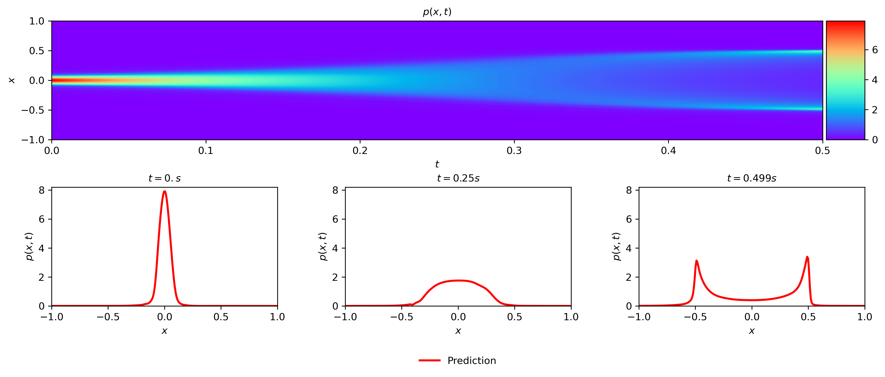
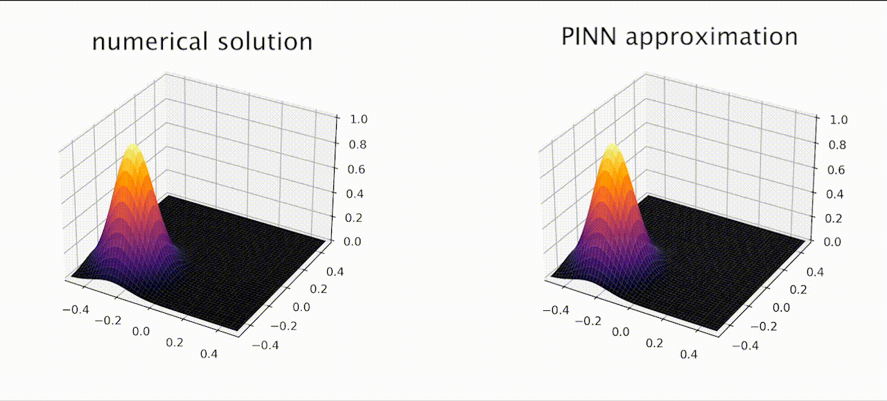

# Physics Informed Neural Networks
- We study the learning theory of PINN soft regularizations and their implementation in TensorFlow.
- We apply the PINN architecture to solve the Fokker-Planck equation for 1D- and 2D-harmonic potentials, with absorbing and reflecting boundaries, as well as for a double-well.
- We then perform a hyper parameter search considering the characteristic failure modes of this PINN setup, and find a good model for large time predictions.

[//]: # ""

